# Triển khai tấn công DDOS

---

## 1.	Tấn công ICMP Flood.

Bước 1: Kiểm tra kết nối giữa 2 máy.
Trước khi tấn công, cần đảm bảo hai máy có thể giao tiếp với nhau. Sử dụng lệnh ping từ cả 2 máy tấn công và máy nạn nhân.

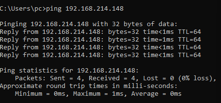

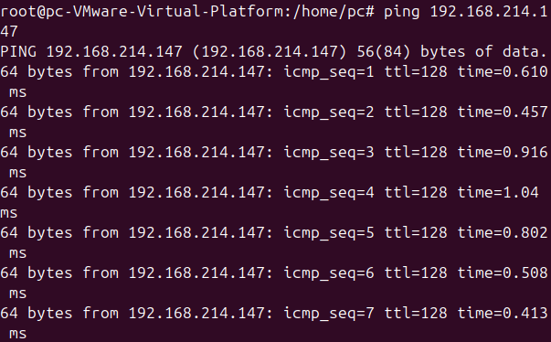

Kết quả hiện thị có phản hồi, hai máy đã kết nối thành công.

Bước 2: Kiểm tra trạng thái hệ thống trước khi tấn công.

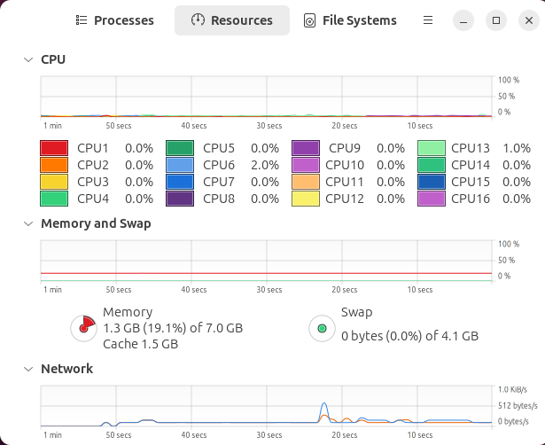

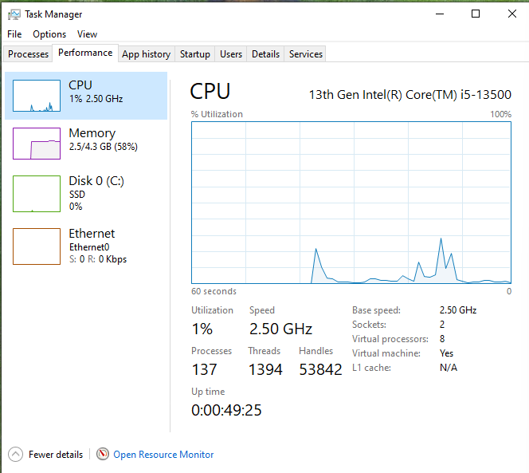

Kết quả cho thấy tài nguyên hệ thống ở mức bình thường, chưa bị quá tải.

Bước 3: Bắt đầu thực hiện tấn công ICMP Flood.
Trên máy tấn công, sử dụng Hping3 để gửi một lượng lớn gói tin ICMP:
```bash
hping3 -1 192.168.214.147 -- flood --rand-source
```
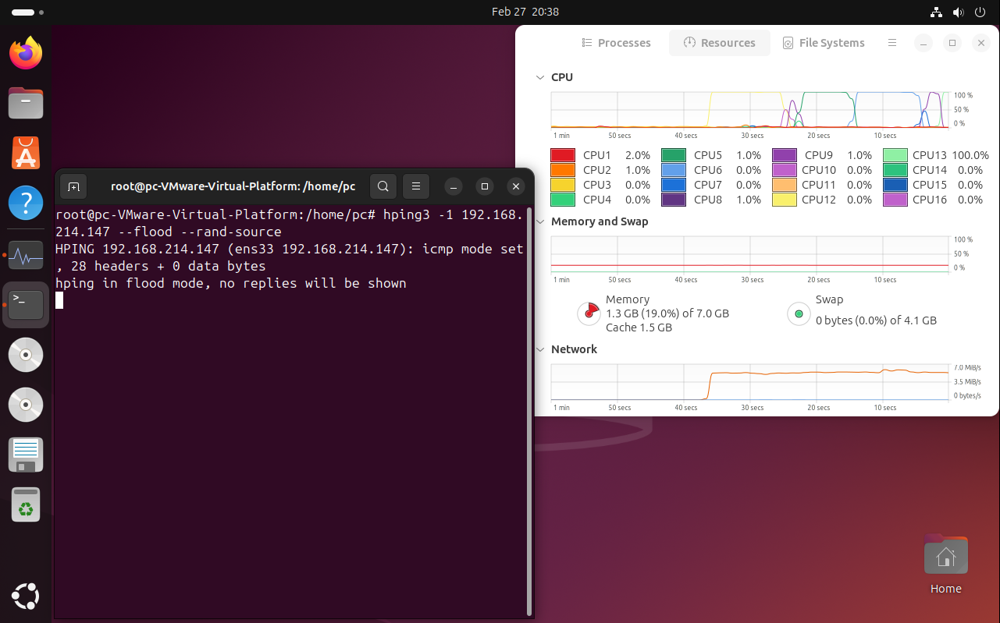

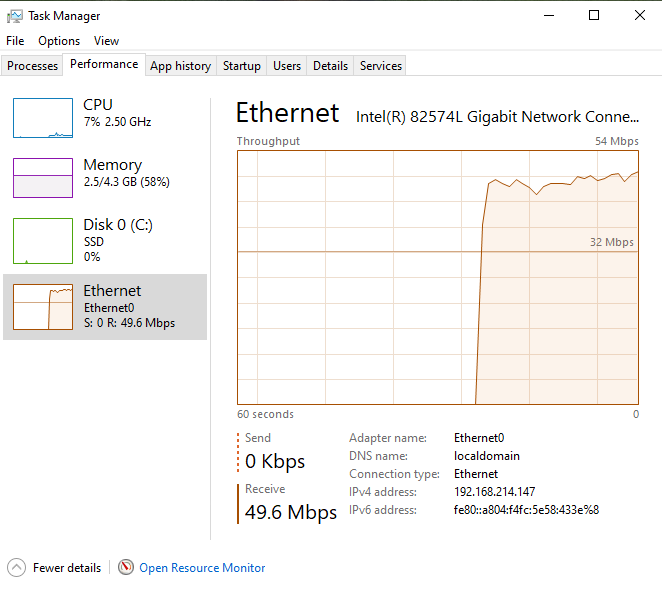

Có thể thấy, tốc độ nhận của máy nạn nhân tăng cao đột ngột, lên đến 49.6 Mbps.

Bước 4: Dùng Wireshark để phân tích lưu lượng.

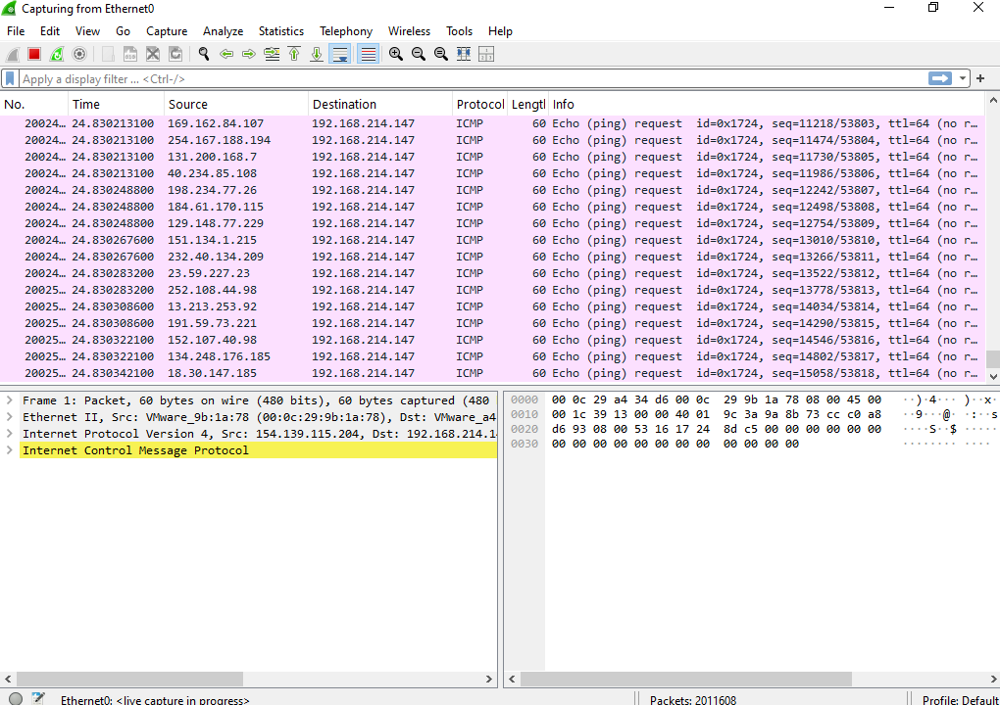

Trên Wireshark có thể thấy hàng loạt gói tin ICMP với địa chỉ IP ngẫu nhiên gửi đến máy nạn nhân.

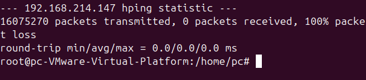

Ở phía máy attacker cho thấy quá trình tấn công diễn ra với cường độ rất lớn, gửi hơn 16 triệu gói tin ICMP đến máy nạn nhân.

## 2.	Tấn công SYN Flood.

Bước 1: Quét cổng đang mở trên máy nạn nhân.

```bash
nmap 192.168.214.147
```

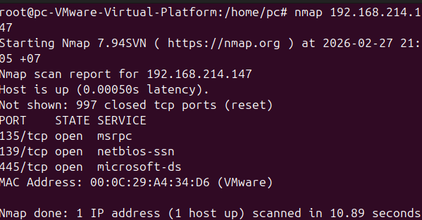

Bước 2: Bắt đầu tấn công SYN Flood.
Trên máy tấn công, sử dụng Hping3 để gửi một lượng lớn gói tin SYN đến cổng 135 của máy nạn nhân.

```bash
hping3 –S 192.168.214.147 -p 135 -d 500 --flood --rand-source
```

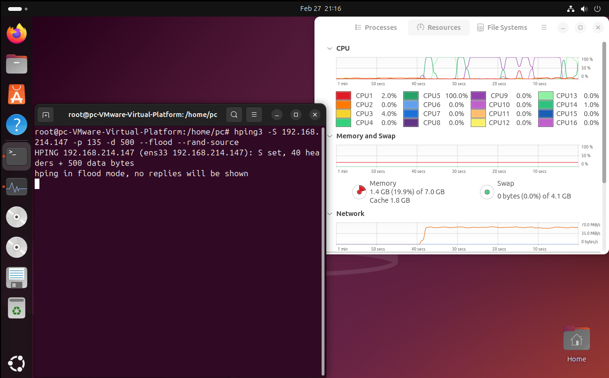

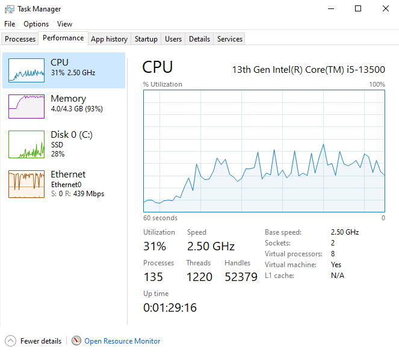

Có thể thấy, sau khi tấn công thì CPU tăng lên 31%, Memory chiếm dụng 93%, đặc biệt tốc độ nhận lên tới 439 Mbps.

Bước 3: Dùng Wireshark để phân tích lưu lượng.

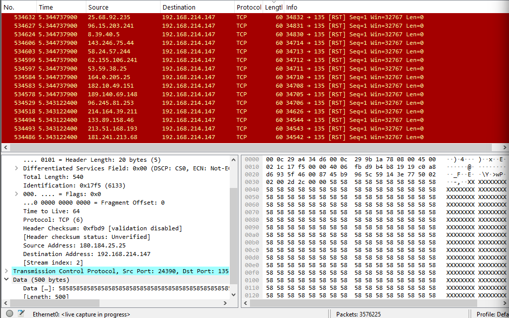

Trên máy nạn nhân, Wireshark bắt được các gói tin SYN từ nhiều địa chỉ IP giả mạo gửi đến cổng 135.

Bước 4: Kiểm tra trạng thái kết nối của máy nạn nhân.
Trên máy nạn nhân, sử dụng lệnh sau để kiểm tra các kết nối đang ở trạng thái SYN_RECEIVED.

```bash
netstat-ano  | findstr SYN_RECEIVED
```

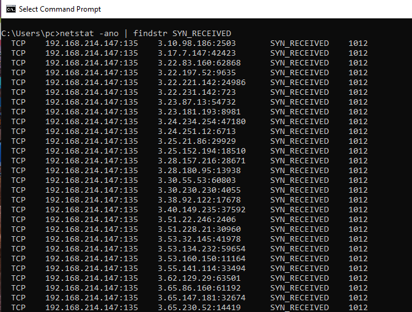

Giải thích lệnh: 
-	netstat -ano: Liệt kê tất cả các kết nối mạng (-a), hiển thị dưới dạng số IP/Port (-n) và kèm theo mã tiến trình PID (-o).
  
-	findstr SYN_RECEIVED: Lọc và chỉ hiển thị các kết nối đang ở trạng thái chờ "mở một nửa" (Half-open).

## 3.	Tấn công HTTP bằng Slowhttptest. 

Demo Web victim:

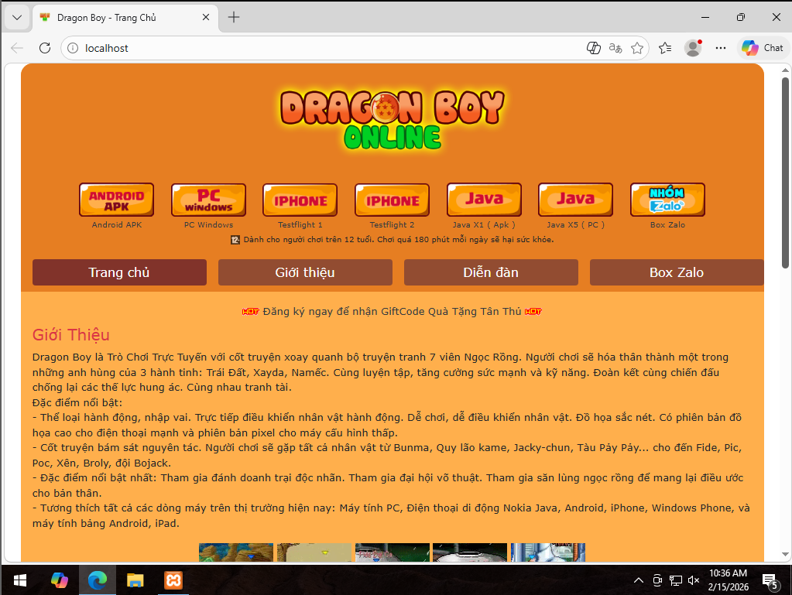

Attack sẽ có 2 phần GET và POST:
-	GET: Cố tình gửi phần Tiêu đề (Header) cực kỳ chậm, khiến máy chủ Web phải chờ đợi vô thời hạn.
-	POST: Khai báo Content-Length rất lớn, nhưng gửi phần thân (Body) cực kỳ chậm (từng byte một). 

Bước 1: Tấn công GET.

```bash
slowhttptest -c 1000 -H -g -o slowloris_report -i 10 -r 200 -t GET -u http://192.168.214.147 -x 24 -p 3
```

Giải thích lệnh:
-	-c 1000: Tổng số lượng kết nối sẽ tạo ra (1000 kết nối).
  
-	-H: Chỉ định chế độ tấn công Slowloris (Slow Headers).
  
-	-g: Bật chế độ xuất biểu đồ thống kê (rất tốt cho báo cáo).
  
-	-o slowloris_report: Tên file xuất ra (sẽ tạo ra file .html và .csv).
  
-	-i 10: Thời gian chờ (interval) giữa mỗi lần gửi dữ liệu nhỏ giọt là 10 giây.
  
-	-r 200: Tốc độ tạo kết nối mới là 200 kết nối/giây.

-	-t GET: Sử dụng phương thức GET.
  
-	-u http://192.168.1.100: URL của máy chủ nạn nhân.
  
-	-x 24: Độ dài tối đa của dữ liệu ngẫu nhiên được gửi đi.
  
-	-p 3: Thời gian timeout là 3 giây để thăm dò xem máy chủ có phản hồi không.
  
Sau khi attack GET, quá trình diễn ra và cho kết quả như sau:

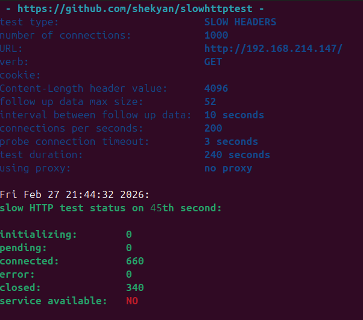

Kết quả hiển thị tại giây thứ 45 của cuộc tấn công cho thấy: 
-	Số kết nối đang hoạt động (connected): 660
-	Số kết nối đã đóng (closed): 340 
-	Trạng thái dịch vụ (service available): NO. 
Điều này cho thấy Web Server đã không còn khả năng phục vụ các yêu cầu mới.

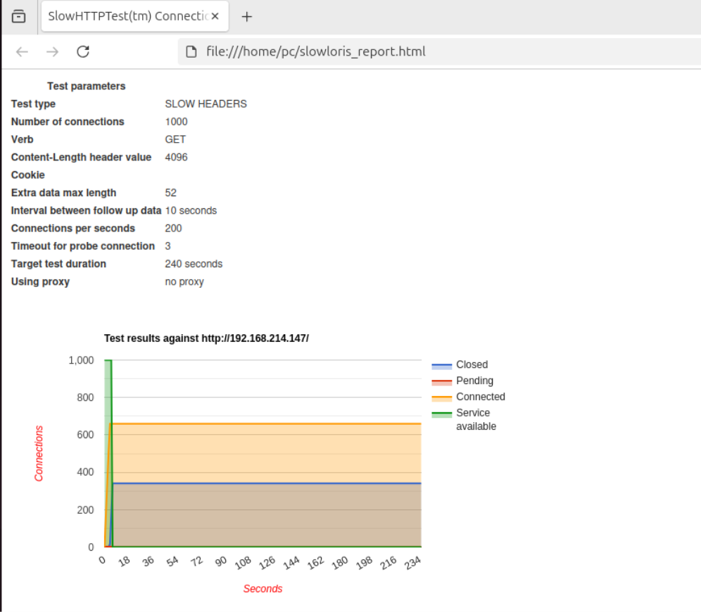

Từ file report  có thể thấy:
-	Tham số tấn công: 1000 kết nối, phương thức GET, kích thước dữ liệu khai báo 4096 bytes, tốc độ 200 kết nối/giấy, thời gian kéo dài 240 giấy.
-	Kết quả: Số Connected và số Closed tăng dần và duy trì ổn định, trong khi Service available giảm về 0.

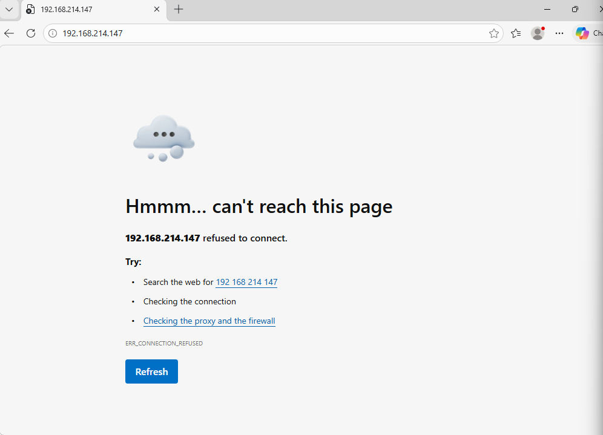

Kết quả nhận được thông báo lỗi, chứng tỏ Web Service đã bị tê liệt hoàn toàn, không thể đáp ứng các yêu cầu truy cập từ người dùng.

Bước 2: Tấn công POST.

```bash
slowhttptest -c 1000 -B -g -o slowpost_report -i 110 -r 200 -s 8192 -t POST -u http://192.168.214.147 -x 10 -p 3
```

Giải thích lệnh:
-	-B: Chế độ tấn công phần Body (Slow POST).
  
-	-s 8192: Khai báo với máy chủ rằng kích thước file/dữ liệu sẽ gửi lên là 8192 bytes.
  
-	-i 110: Mỗi 110 giây mới gửi 1 mảnh dữ liệu nhỏ (kéo dài thời gian chiếm dụng kết nối).
  
Sau khi attack POST, quá trình diễn ra và kết quả như sau:

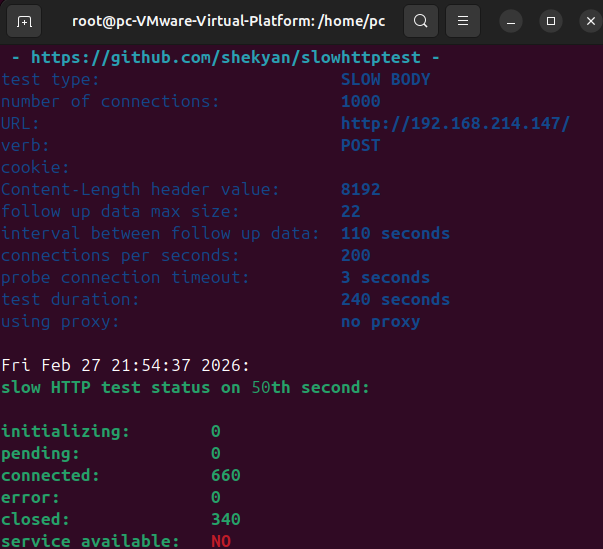

Kết quả hiện thị tại giây thứ 50 của cuộc tấn công cho thấy:
-	Số kết nối đang hoạt động (connected): 660.
-	Số kết nối đã đóng (closed): 340.
-	Trạng thái dịch vụ (service available) : NO.
Điều này cho thấy Web Server đã không còn khả năng phục vụ các yêu cầu mới.

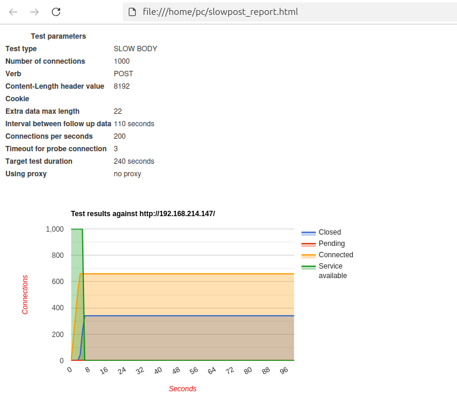

Từ file report có thể thấy:
-	Tham số tấn công: 1000 kết nối, phương thức POST, kích thước dữ liệu khai báo 8192 bytes, tốc độ 200 kết nối/giây.
-	Kết quả: Số Connected và Closed tăng dần và duy trì ổn định, trong khi Service available giảm về 0.

## 3.	Mô phỏng mạng botnet tấn công (Py-botnet) by MayankFawkes. 

### Github:  https://github.com/MayankFawkes/Python-Botnet

### Phân tích code: [Analysis](Docs/analysis.md)

Bước 1: Khởi chạy server.
Trên máy tấn công, khởi chạy server điều khiển botnet:

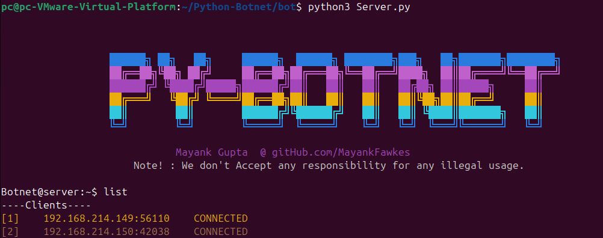

Trong trường hợp này, có 2 bot đã kết nối thành công vào server điều khiển với địa chỉ IP lần lượt là 192.168.214.149 và 192.168.214.150.
Trong quá trình các bot tấn công, sử dụng Wireshark để bắt gói tin:

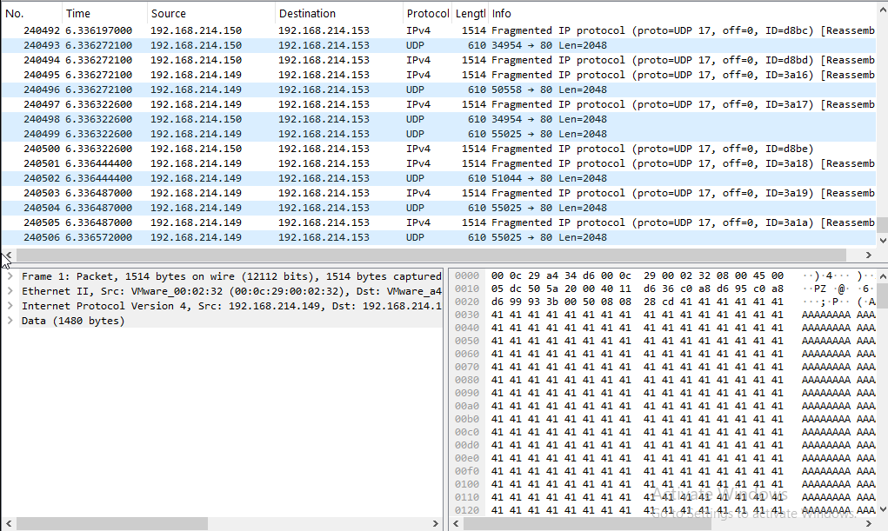

Từ kết quả trên, có thể thấy:
-	Các bot đã kết nối thành công vào server, sẵn sàng thực hiện tấn công.
  
-	Lưu lượng tấn công từ các bot gửi đến mục tiêu là rất lớn và liên tục, với nhiều gói tin UDP được gửi đi trong thời gian ngắn.
  
-	Dữ liệu trong các gói tin chủ yếu là các kí tự “A” lặp lại, thể hiện đây là dữ liệu rác nhằm chiếm dụng tài nguyên và băng thông của mục tiêu.

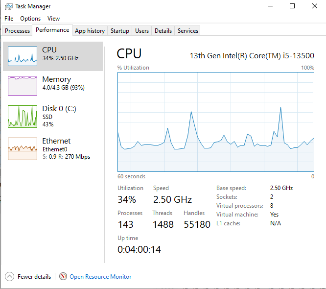

Từ kết quả trên, có thể thấy:
-	Các bot đã kết nối thành công vào server, sẵn sàng thực hiện tấn công.
  
-	Lưu lượng tấn công từ các bot gửi đến mục tiêu là rất lớn và liên tục, với nhiều gói tin UDP được gửi đi trong thời gian ngắn.
  
-	Dữ liệu trong các gói tin chủ yếu là các kí tự “A” lặp lại, thể hiện đây là dữ liệu rác nhằm chiếm dụng tài nguyên và băng thông của mục tiêu.
  
