# Triển khai phòng thủ DDOS

---

## 1.	Triển khai cấu hình tường lửa IPtables để chặn IP/Lọc gói tin.

IPtables là tường lửa tích hợp sẵn trên Linux, hoạt động dựa trên các quy tắc (Rules) nằm trong các chuỗi (Chains). Đối với việc ngăn chặn DDoS, chúng ta tác động chủ yếu vào chuỗi dữ liệu đi vào server (Input).
Các hành động cơ bản:
-	ACCEPT: Cho phép gói tin đi qua.
-	DROP: Loại bỏ gói tin ngay lập tức, kẻ tấn công sẽ không nhận được phản hồi.
-	REJECT: Từ chối gói tin và gửi lại thông báo lỗi, hành động này không khuyến khích sử dụng vì khi bị tấn công DDoS sẽ làm tốn thêm tài nguyên để gửi tin báo lỗi.

Bước 1: Kiểm tra trạng thái IPtables ban đầu.
Trước khi thêm các rule phòng chống, kiểm tra cấu hình IPtables hiện tại trên máy nạn nhân.

```
iptables -L -n -v
```
Giải thích lệnh:
-L: Liệt kê các rules hiện có trong chain.
-n: Hiện thị IP dạng số.
-v: Hiện thị chi tiết lưu lượng gói tin đã chặn.

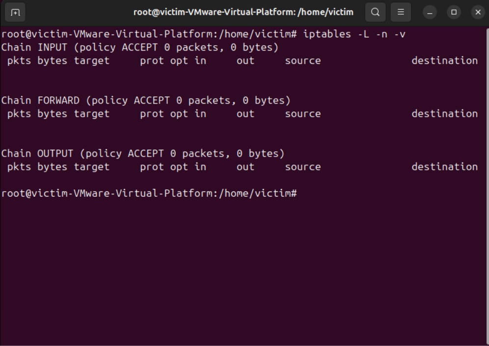

Các câu lệnh DROP:

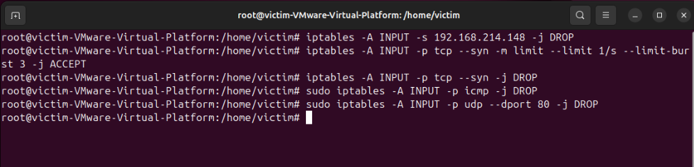

1.	Chặn đích danh IP tấn công.

```
sudo iptables -A INPUT -s <IP_Attacker> -j DROP
```

Khi bị tấn công:

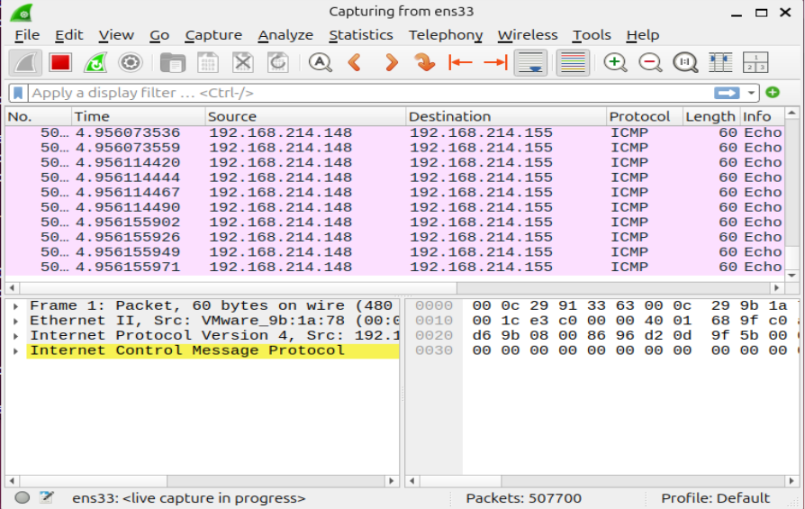

Kiểm tra CMD:

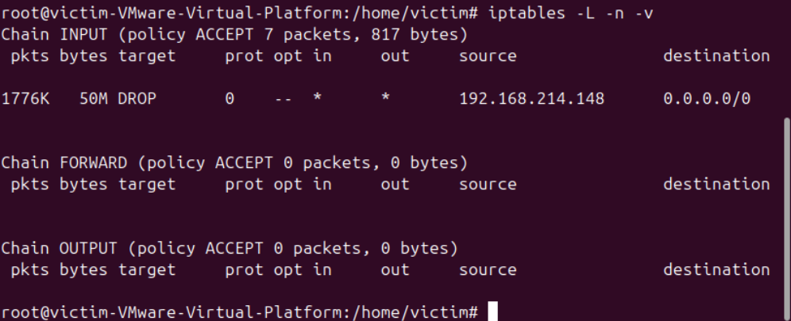

Kết quả cho thấy đã có 1776K gói tin với dung lượng 50MB từ địa chỉ IP 192.168.214.148 đã bị chặn (DROP). Các rule chặn đã hoạt động hiệu quả, bảo vệ máy nạn nhân khỏi tấn công.

2.	Lọc gói tin theo giao thức SYN.

```
sudo iptables -A INPUT -p tcp --syn -m limit --limit 1/s --limit-burst 3 -j ACCEPT
sudo iptables -A INPUT -p tcp --syn -j DROP
```

Giải thích lệnh:
-	-A INPUT (Append): Thêm hoặc chèn vào cuối quy tắc này vào chuỗi INPUT. Chuỗi INPUT chịu trách nhiệm xử lí tấc cả các gói tin bên ngoài đi vào máy chủ của bạn.
  
-	-p tcp (Protocol): Chỉ định quy tắc này chỉ áp dụng cho giao thức TCP.
  
-	--syn: Đây là cờ (flag) đặc biệt. Nó yêu cầu IPtables chỉ bắt các gói tin TCP có cờ SYN được bật.
  
-	-m limit (Match): Gọi một module mở rộng của IPtables có tên là limit. Module này cung cấp khả năng đếm và giới hạn tốc độ gói tin.
  
-	--limit 1/s: Đặt tốc độ tối đa cho phép là 1 gói tin/giây. Có thể thay đổi thành 1/m (phút), 1/h (giờ) tùy nhu cầu.
  
-	--limit-burst 3: Quy định số lượng gói tin “bùng nổ” (burst) tối đa ban đầu được phép di chuyển qua cùng lúc trước khi IPtables bắt đầu áp dụng tốc độ 1/s ở trên. Ở đây cho phép tối đa 3 gói tin đến cùng lúc.
  
-	-j ACCEPT / DROP (Jump): Hành động sẽ thực thi nếu gói tin khớp với điều kiện trên.

-	ACCEPT: Cho phép gói tin đi qua tường lửa để vào hệ điều hành xử lý.
  
-	DROP: Vứt bỏ gói tin ngay lập tức, kẻ tấn công sẽ không nhận được bất kì phản hồi nào, khiến chúng bị treo, chờ đợi.
  
Khi bị tấn côngtấn công:

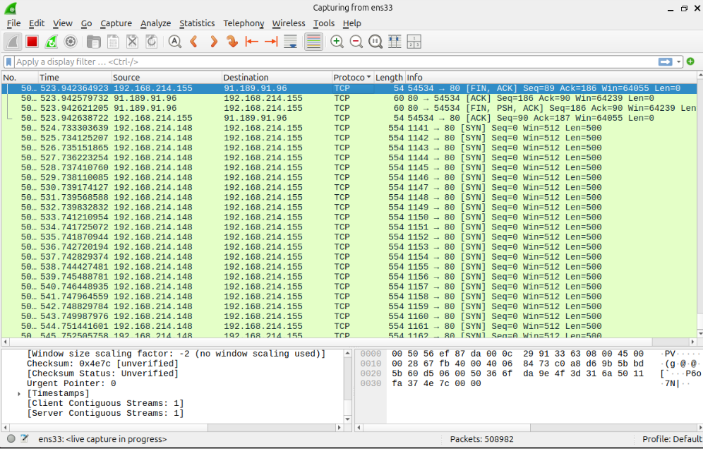

Kiểm tra CMD:

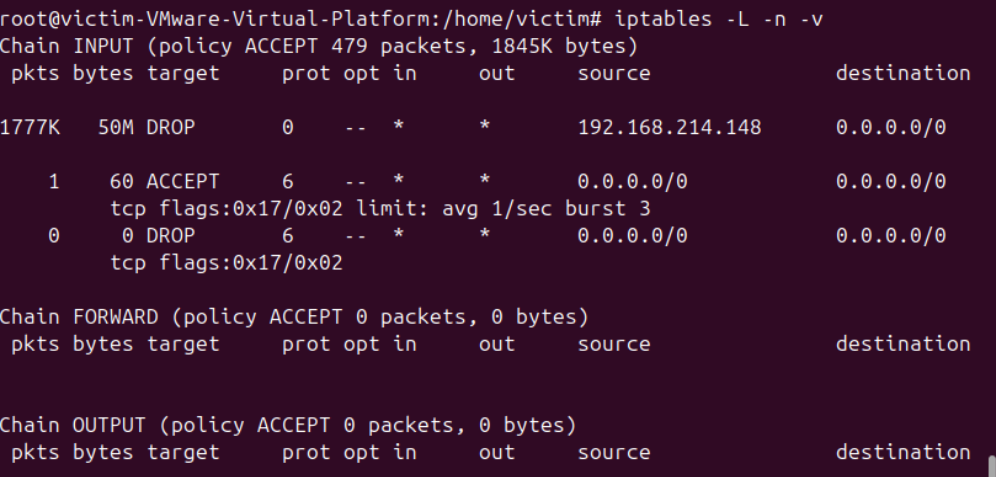

Kết quả cho thấy đã có 1777K gói tin với dung lượng 50MB từ địa chỉ IP 192.168.214.148 đã bị chặn (DROP). Rule giới hạn SYN đã hoạt động, chỉ 1 gói tin được ACCEPT, các gói SYN vượt quá ngưỡng “burst“ (3 gói) đều bị DROP. Máy nạn nhân đã được bảo vệ khỏi tấn công SYN Flood.

3.	Chặn ICMP Flood.

```
iptables -A INPUT -p icmp -j DROP
```

Chặn đích danh chỉ chặn được 1 địa chỉ IP nhưng khi biết được giao thức tấn công thì có thể chặn hoàn toàn để chống lại tool --rand-source.
Khi bị tấn công:

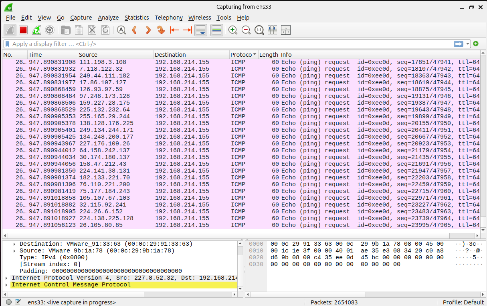

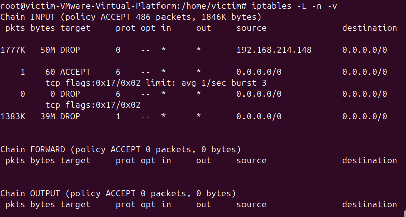

Kết quả cho thấy, đã có 1770K gói tin với dung lượng 50MB từ địa chỉ IP 192.168.214.128 đã bị chặn (DROP). Có 1383K gói tin ICMP với dung lượng 39MB đã bị chặn hoàn toàn. Các rule chặn SYN Flood vẫn hoạt động, có 1 gói ACCEPT, các gói SYN vượt ngưỡng đều bị DROP. Rule chặn ICMP đã hoạt động hiệu quả.  

4.	Chặn UDP Flood.

```
sudo iptables -A INPUT -p udp -dport 80 -j DROP
```

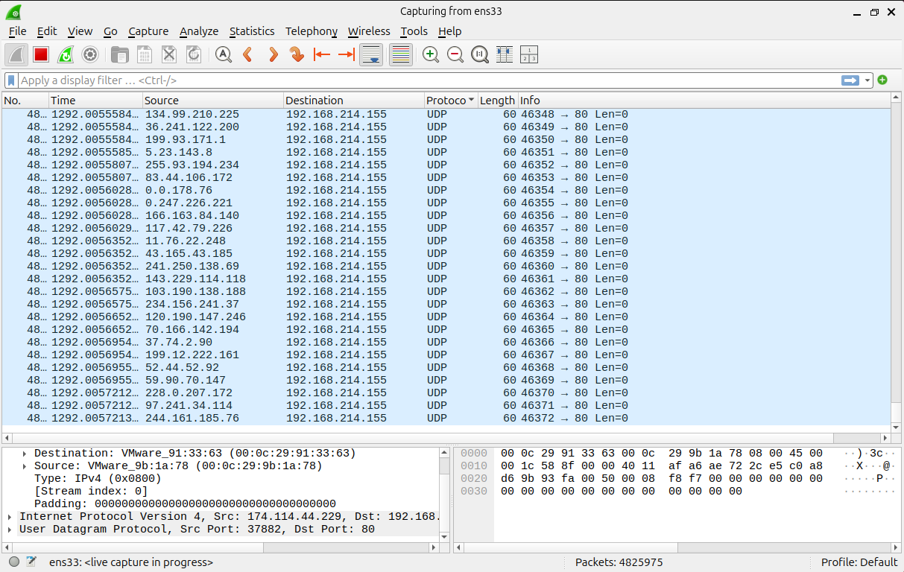

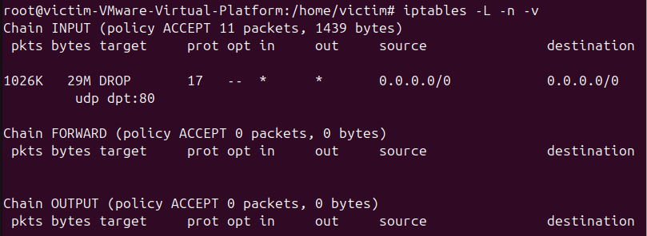

Kết quả cho thấy, đã có 1026K gói tin UDP với dung lượng 29MB gửi đến cổng 80 đã bị chặn (DROP). Giao thức UDP (protocol 17) đã bị chặn hoàn toàn trên cổng 80. Rule chặn UDP Flood đã hoạt động hiệu quả, bảo vệ máy nạn nhân khỏi tấn công UDP Flood.

## 2.	Cấu hình Snort IDS để phát hiện và cảnh báo tấn công theo thời gian thực.

Snort là hệ thống phát hiện xâm nhập mạng (Network Intrusion Detection System - NIDS) mã nguồn mở, có khả năng phân tích lưu lượng mạng theo thời gian thực và đưa ra cảnh báo khi phát hiện các dấu hiệu tấn công.

Bước 1: Cấu hình file snort.conf:

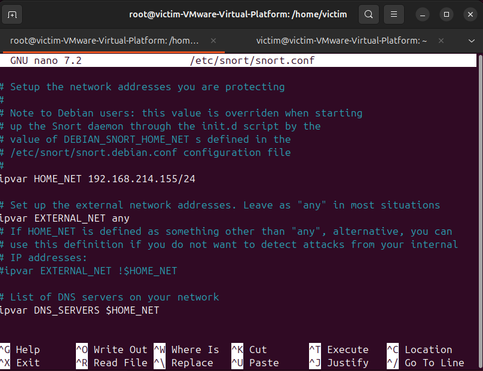

Bước 2: Cấu hình file local.rules:

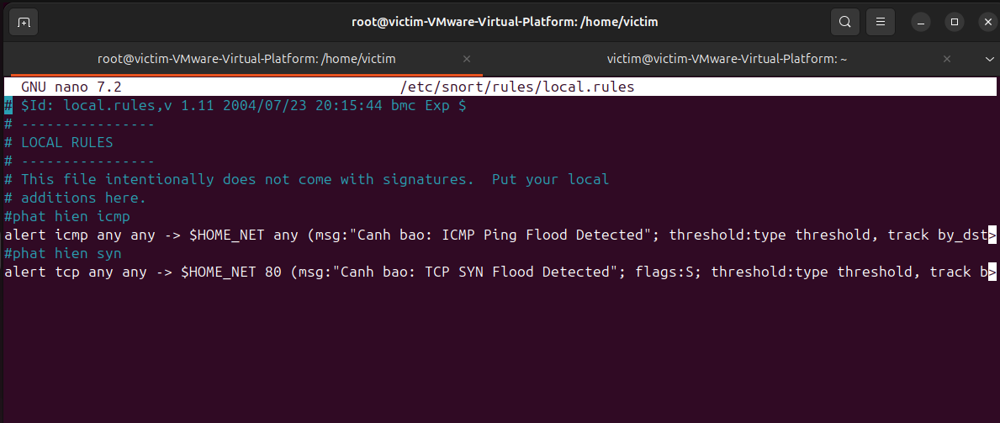

-	Phát hiện tấn công ICMP Flood:

```
alert icmp any any -> $HOME_NET any (msg:"Canh bao: ICMP Ping Flood Detected"; threshold:type threshold, track by_dst, count 50, seconds 5; sid:1000001; rev:1;)
```

-	Phát hiện tấn công SYN Flood:

```
alert tcp any any -> $HOME_NET 80 (msg:"Canh bao: TCP SYN Flood Detected"; flags:S; threshold:type threshold, track by_dst, count 100, seconds 10; sid:1000002; rev:1;)
```

Giải thích lệnh:
-	msg: “...” (Message): Đây là thông điệp cảnh bảo được in ra màn hình hoặc ghi vào file log khi rule kích hoạt. Ví dụ: "Canh bao: ICMP Ping Flood Detected".
-	sid:1000001 và sid:1000002 (Snort ID): Mã định danh duy nhất cho mỗi rule. Các rule mặc định của Snort có SID dưới 1.000.000. Rule do người dùng tự định nghĩa phải có SID từ 1.000.000 trở lên để tránh xung đột. 
-	rev:1 (Revision): Số phiên bản của rule. Khi chỉnh sửa rule, tăng số rev để dễ theo dõi lịch sử thay đổi. 
-	threshold:type threshold, track by_dst, count 50, seconds 5: 
-	typethreshold: Snort sử dụng cơ chế đếm để quyết định cảnh báo. 
-	track by_dst: Gom nhóm và đếm gói tin theo IP đích (máy nạn nhân).
-	count 50, seconds 5: Cảnh báo khi có ít nhất 50 gói tin trong 5 giây vào cùng một IP đích. 
-	flags:S;: Chữ "S" đại diện cho cờ SYN trong giao thức TCP. Trong quá trình bắt tay 3 bước, gói tin đầu tiên luôn bật cờ SYN. Kẻ tấn công SYN Flood gửi hàng loạt gói tin SYN nhưng không hoàn tất kết nối, làm server bị treo. Tùy chọn này giúp Snort chỉ bắt các gói tin có cờ SYN để phân tích. 
-	threshold:type threshold, track by_dst, count 100, seconds 10: 
-	Tương tự rule ICMP nhưng ngưỡng được nâng lên 100 gói trong 10 giây. 
-	Lý do: Lưu lượng TCP vào web server (cổng 80) bình thường đã cao hơn ICMP. Nếu đặt ngưỡng quá thấp, Snort sẽ báo động nhầm (False Positive) khi có nhiều người dùng hợp lệ truy cập cùng lúc.

Bước 3: Bắt Log:

```
sudo snort -A console -q -u snort -g snort -c /etc/snort/snort.conf -i ens33
```

Giải thích lệnh:
•	-A console: In cảnh báo (Alert) trực tiếp ra màn hình console thay vì chỉ ghi vào file log ẩn. 
•	-q (Quiet): Chế độ im lặng, ẩn các thông báo khởi động rườm rà để dễ nhìn log tấn công hơn. 
•	-u snort -g snort: Chạy Snort dưới quyền của user và group tên là "snort" để tăng tính bảo mật. 
•	 -c: Chỉ định đường dẫn tới file cấu hình. 
•	 -i: Chỉ định card mạng cần lắng nghe.

-	Phát hiện ICMP Flood:

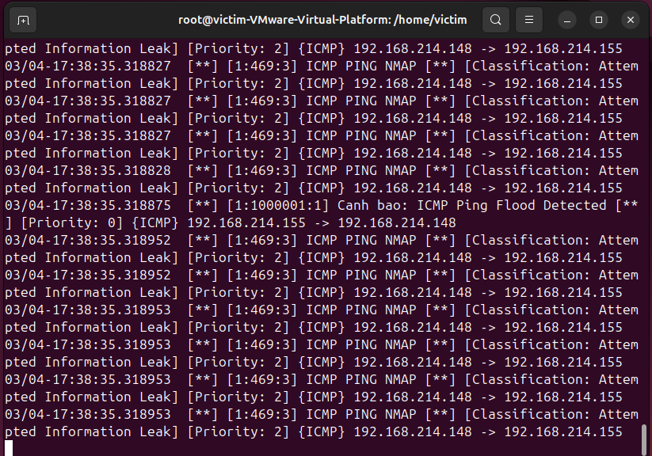

-	Phát hiện SYN Flood:
  
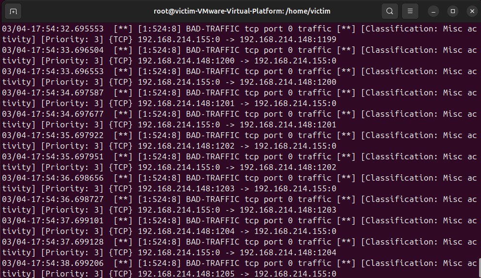

## 3.	Phân tích lưu lượng bằng Python để xác định nguồn tấn công.

### Nguồn code : [Python](Py-defense/Server.py)
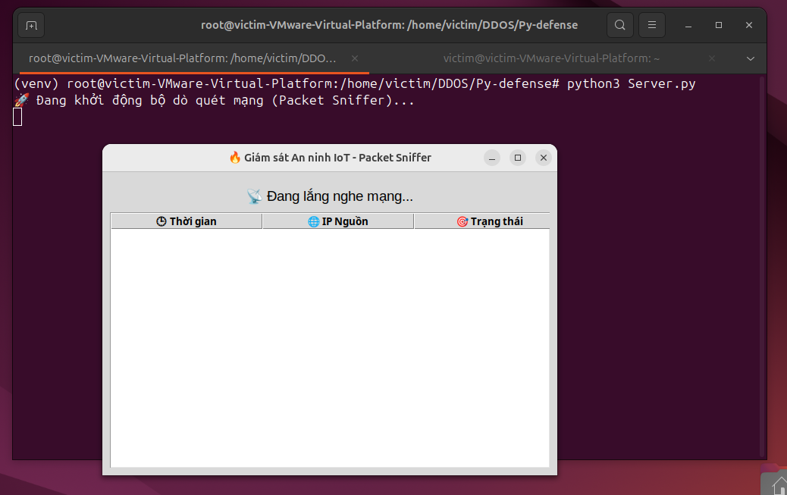
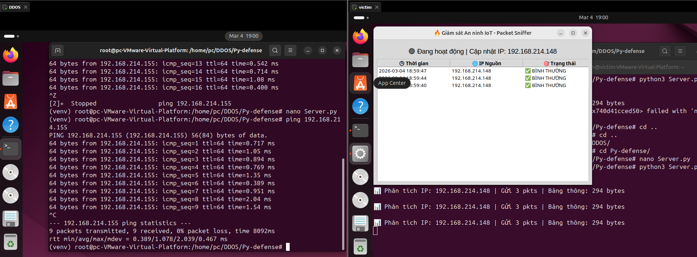
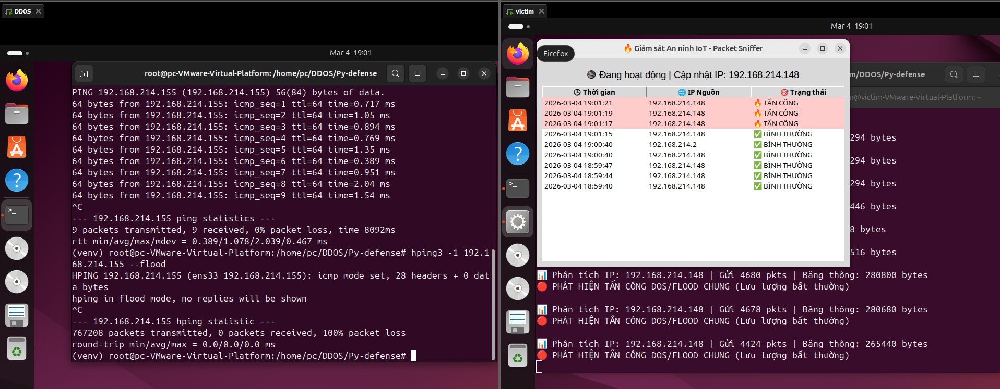
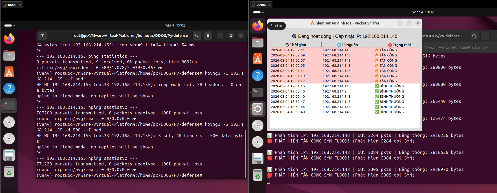
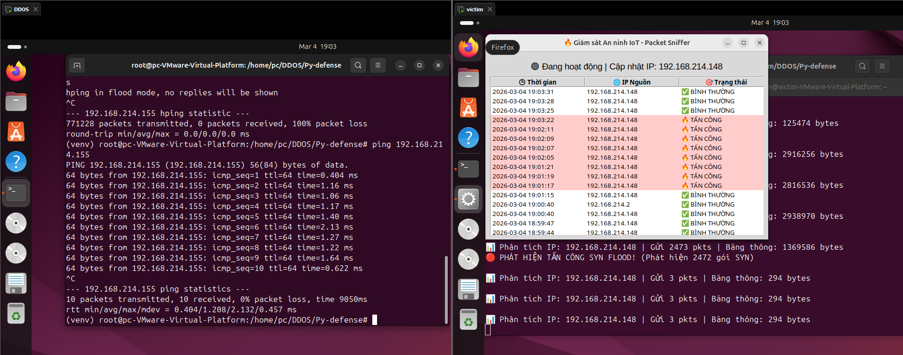
