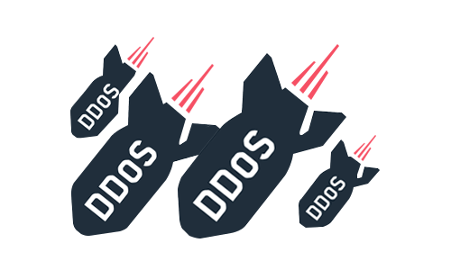

# Chuẩn bị môi trường

Trang này giúp bạn chuẩn bị các công cụ cơ bản **trước khi** tiến hành tấn công và phòng thủ DDOS.

> **Mục tiêu:** Chuẩn bị hệ thống, dải mạng (IPs, ports).





---

# Environment Preparation

## 1) Topology & IP Plan

| Component       | IP Address      | 
|-----------------|-----------------|
|     Attacker   | 192.168.214.148  | 
|     Victim     | 192.168.214.147  | 
|     Zombie1    | 192.168.214.149  | 
|     Zombie2    | 192.168.214.150  | 

> **Note:**  
> - Điều chỉnh địa chỉ IP cho phù hợp với môi trường mạng của bạn.
> - Đảm bảo mỗi thành phần đều có thể truy cập được qua mạng bằng SSH, RDP hoặc các giao thức web khi cần thiết.


## 2) Hardware & OS Requirements

- **OS**: Ubuntu 20.04+ (Gợi ý cho máy chủ Attacker)
- **CPU**: 2 vCPUs (Tối thiểu), 4+ vCPUs là hợp lý
- **RAM**: 6 GB tối thiểu, 8 GB là hợp lý
- **Disk**: 30 GB free (Nhật ký và bản ghi phiên có thể yêu cầu thêm dung lượng lưu trữ.)
- **Network**: Stable LAN access to all assets (SSH/RDP/DB connections)
- **Tools**:
  - Hping3
  - Slowhttptest 
  - Python3
  - Web (FireFox)


#### For Ubuntu:
```bash
sudo apt-get update
sudo apt-get install hping3
sudo apt-get install Slowhttptest
```

---


